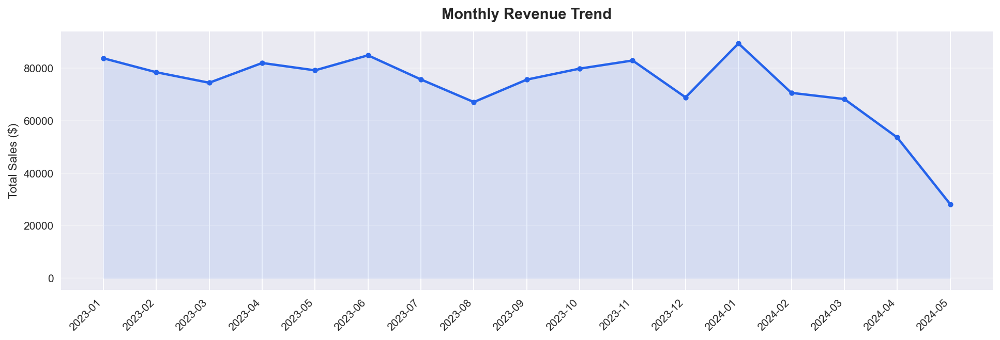
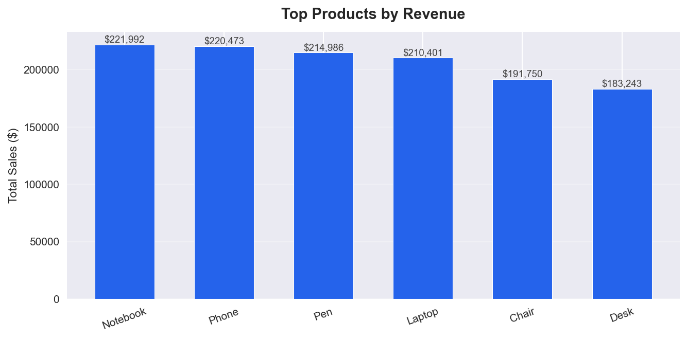
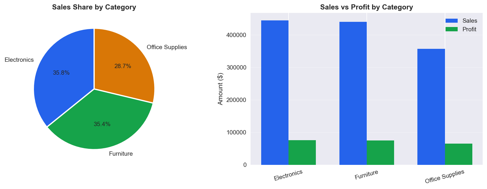
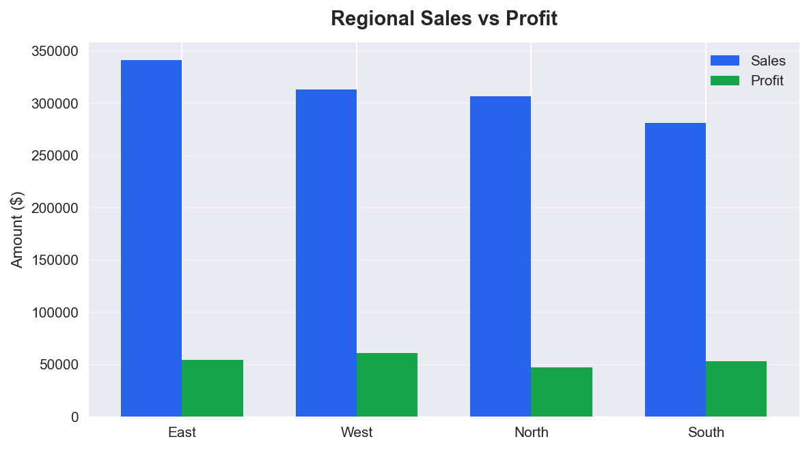
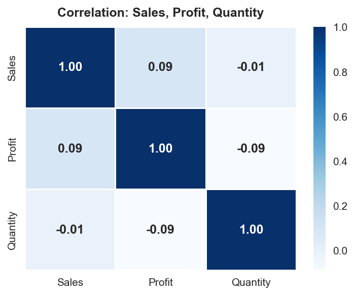
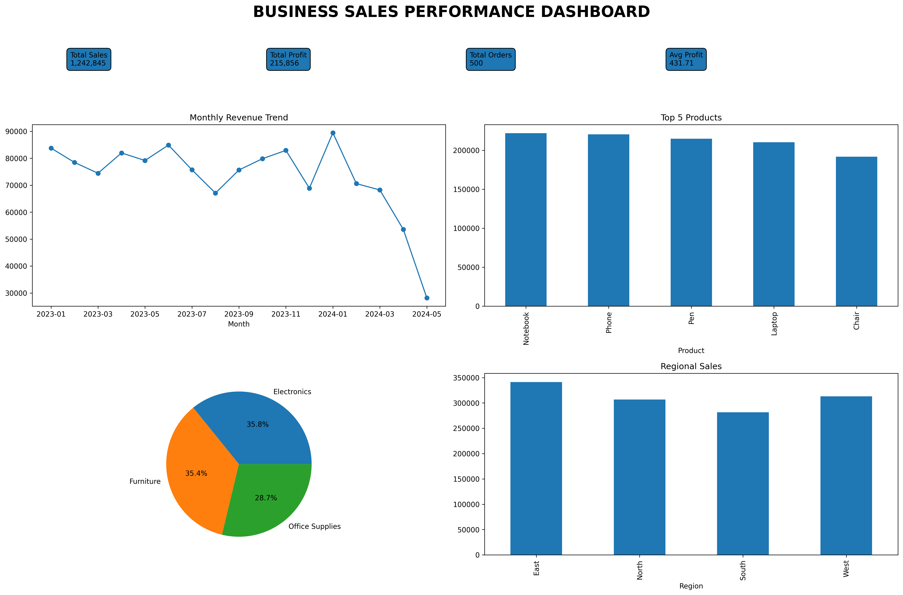

# FUTURE_DS_01 — Business Sales Performance Analytics

## Future Interns | Data Science & Analytics Track

---

## Overview

This project analyzes retail sales data to identify business trends, top-performing products, category-wise performance, and regional sales patterns. The objective is to generate actionable insights that can help improve business decision-making and overall sales performance.

## Dataset

The dataset contains retail sales transaction records, including:

- Order Date
- Product Name
- Category
- Region
- Sales
- Profit

More than 500 sales records were analyzed to uncover trends and performance metrics.

## Tools & Libraries

- Python 3
- Pandas
- NumPy
- Matplotlib
- Seaborn
- Jupyter Notebook
- VS Code

## Project Workflow

1. Data Loading
2. Data Cleaning
3. Exploratory Data Analysis (EDA)
4. Monthly Revenue Analysis
5. Top Product Analysis
6. Category Performance Analysis
7. Regional Performance Analysis
8. Correlation Analysis
9. Business Insights & Recommendations

## Visualizations Created

- Monthly Revenue Trend
- Top Selling Products
- Category Performance
- Regional Performance
- Sales vs Profit Correlation Heatmap

## Key Findings

- Best Region: [East]
- Top Product: [Notebook]
- Profit Margin: [17.4 %]
- Weakest Region: [South]

## Recommendations

1. Increase stock levels for top-performing products.
2. Focus marketing efforts on the highest-revenue region.
3. Launch promotional campaigns in underperforming regions.
4. Prepare inventory for high-demand seasons.
5. Expand investment in the best-performing product categories.

## Files

| File | Description |
|------|-------------|
| task1_sales_analysis.ipynb | Main analysis notebook |
| sales_data.csv | Dataset used for analysis |
| README.md | Project documentation |
| screenshots/ | Folder containing all visualization outputs |

## Screenshots

### Monthly Revenue

### Top Products

### Category Performance

### Regional Performance

### Correlation Heatmap

### Executive Business Dashboard

## Executive Business Dashboard

The dashboard provides a consolidated view of key business metrics, revenue trends, product performance, category contribution, and regional sales performance.

## Conclusion

The analysis successfully identified key sales trends, high-performing products, profitable categories, and regional opportunities. These insights can support strategic decisions related to inventory management, marketing campaigns, and business growth.

---

### Author

Nishanth Y Poojary

Future Interns – Data Science & Analytics Internship